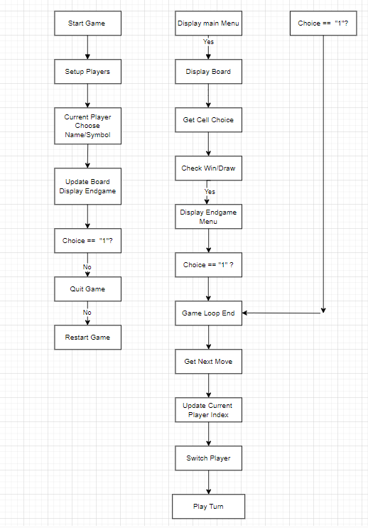
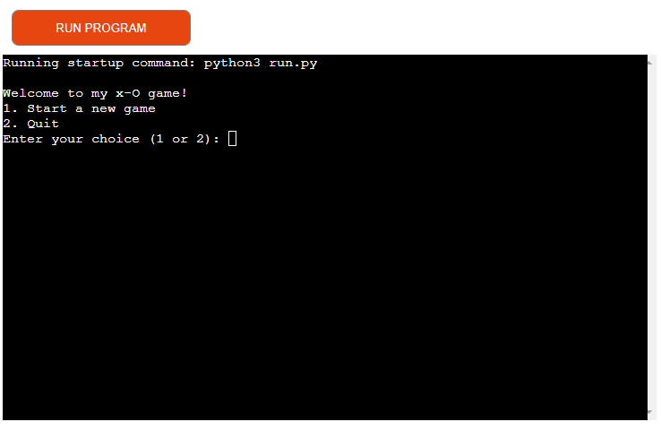
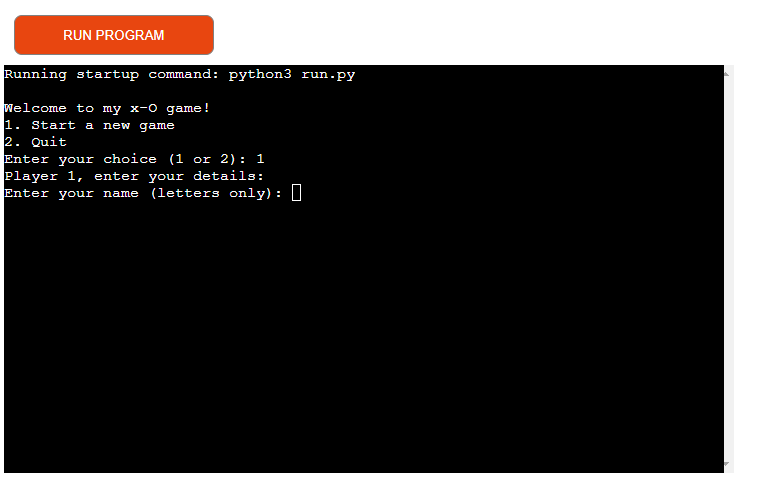
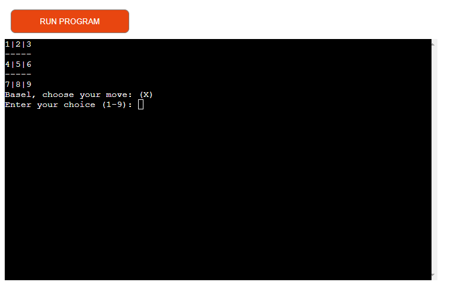
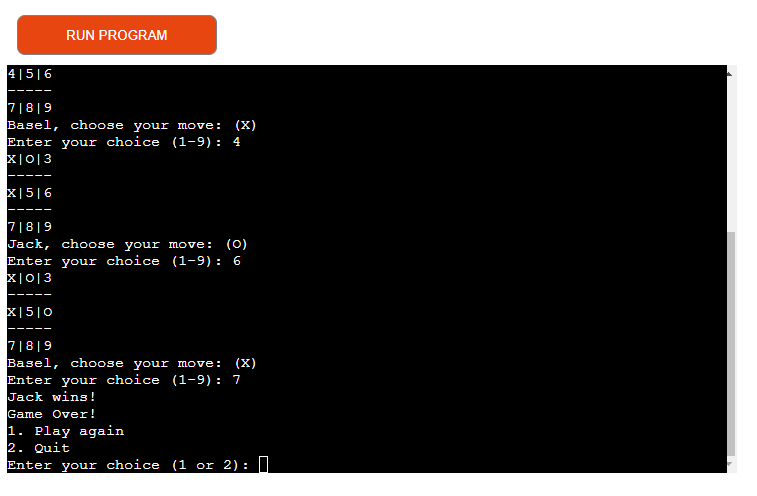
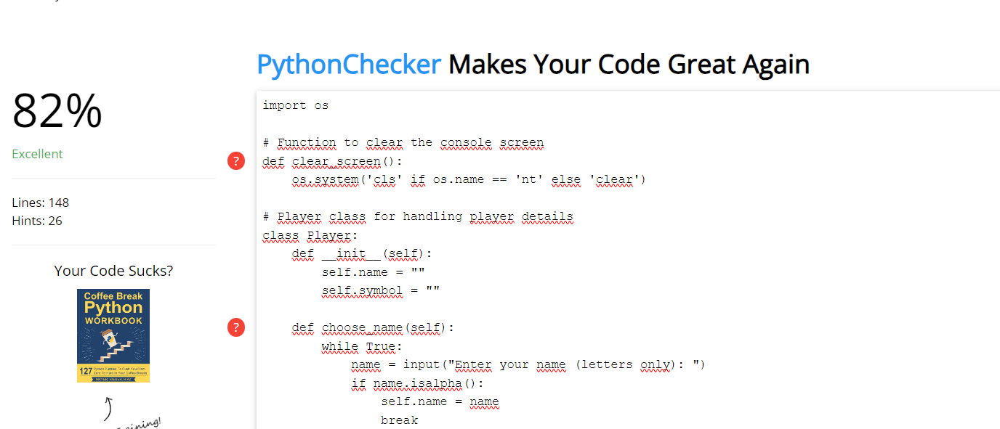

# Tic-Tac-Toe Game

Welcome to my simple implementation of the Tic-Tac-Toe game in Python!
The Tic-Tac-Toe game is a console-based implementation of the classic game. It involves two players who take turns marking spaces on a 3x3 grid. The game continues until one player wins by forming a line of three consecutive symbols (X or O) horizontally, vertically, or diagonally, or until the entire grid is filled, resulting in a draw.

[Link to live site](https://tic-pp3-5d5ce1a76eff.herokuapp.com/)

## Index - Table of Contents

- [Planning](#planning)

The following flowchart (created with [diagrams.net](https://app.diagrams.net/)) visualizes the planning process for this application.

- [Features](#features)
   ### Content

   - Welcome message

   

   - Tic-Tac-Toe playes with 2 players

   

   - The game start when the first player choose the nummber of cell

   

   - End game when any player win or draw

   

- [Testing](#testing)
- HTML, CSS and JavaScript validation does not apply to this project. The template provided by Code Institute as provided to all students is assumed to be tested for the above.
    - [Validator Testing](#validator-testing)
    - Python Validator (https://www.online-ide.com/online_python_syntax_checker)

- The game working ver good no error.

    I test on Google Chrom browser and it´s working without problem

    - And i testet on (https://www.pythonchecker.com/)
##
#
- [Deployment](#deployment)
### Deploy on Heroku
This project was deployed with Heroku using Code Institute's mock terminal as provided with the Python Essentials template.

To deploy:

- Clone or fork this public repository
- Create a Heroku account (if not already existing)
- Create a new app with Heroku
- I didn´t yoused any buildpacks

- Allowing Heroku access to GitHub, link the new app to the relevant repository
- Choose whether or not to enable **Automatic Deploys**. If enabled, the deployed app will update automatically with each push to GitHub
- Click **Deploy**

- [Credits](#credits)
  - [Google translate]
  - [W3Schools](https://www.w3schools.com/)
  - [Stack overflow](https://stackoverflow.com/)
  - Code Institute Slack Channel
- Special thanks to  mentor Dick Vlaanderen.
    

    **Template and Terminal**

    [Python Essentials Template](https://github.com/Code-Institute-Org/python-essentials-template) provided by Code Institute 

   

