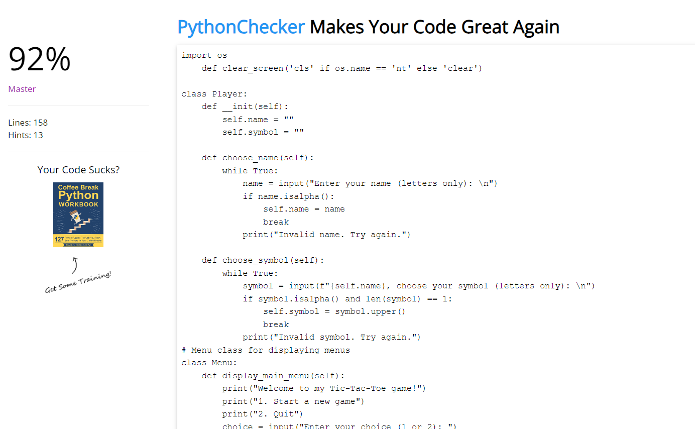

# Tic-Tac-Toe Game

Welcome to my simple implementation of the Tic-Tac-Toe game in Python!
The Tic-Tac-Toe game is a console-based implementation of the classic game. It involves two players who take turns marking spaces on a 3x3 grid. The game continues until one player wins by forming a line of three consecutive symbols (X or O) horizontally, vertically, or diagonally, or until the entire grid is filled, resulting in a draw.

[Link to live site](https://tic-pp3-5d5ce1a76eff.herokuapp.com/)

## Index - Table of Contents

- [Planning](#planning)

- [Design](#design)

- [Features](#features)
   ### Content

   - Welcome Massage 

   

   - Tic-Tac-Toe playes with 2 players

   

- [Data Model](#data-model)

- [Testing](#testing)
- HTML, CSS and JavaScript validation does not apply to this project. The template provided by Code Institute as provided to all students is assumed to be tested for the above.
    - [Validator Testing](#validator-testing)
    - Python Validator (https://www.online-ide.com/online_python_syntax_checker)

- The game working ver good no error.

    - [Browser Testing](#browser-testing)

    I test on Google Chrom browser and it´s working without problem

    - And i testet on (https://www.pythonchecker.com/)

- [Debugging](#debugging)
    - [Fixed bugs](#fixed-bugs)
    - [Unfixed bugs](#unfixed-bugs)

- [Deployment](#deployment)

- [Credits](#credits)
    - [Data](#data)
    - [Code](#code)

    **Template and Terminal**

    [Python Essentials Template](https://github.com/Code-Institute-Org/python-essentials-template) provided by Code Institute 

    - [Styling](#styling)

